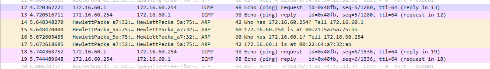

# Part 2

## Exp 1

### Lab

As the first step of this lab, we have to reset the configuration of the MicroTik router. To do so, we will connect two cables in the following way:

> RS232 -> cisco to gnu64 S0
>
> cisco -> RS232 to MicroTik Console

After this we will set the Baudrate of the serial port to 115200 and press enter on the GTK Term. We run the following command:

```bash
/system reset-configuration
```

Having all the previous configurations reset we are ready to phisically connect the computers `gnu63` and `gnu64` to the same 1

| gnu63                  | gnu64                  |
| ---------------------- | ---------------------- |
| IP: 172.16.60.1        | IP: 172.16.60.254      |
| MAC: 00:22:64:a7:32:ab | MAC: 00:21:5a:5a:75:bb |

### Questions:

<details>
    <summary>What are the commands required to configure this experience?</summary>

```bash
ifconfig eth0 {ip}  # set ip address
ping {ip}           # verify connection between the current computer and the computer with {ip} address
route -n           # show the routing table
arp -a             # show all the entris of the arp table
arp -d {ip}         # delete the entry of the arp table with {ip} address
```

</details>

<details>
    <summary>What are the ARP packets and what are they used for?</summary>
    
```
ARP (Address Resolution Protocol) is a protocol that is used to find the Media Access Control (MAC) address of a network neighbour for a given IPv4 address. This command is used to manipulate or display the kernel's IPv4 network neighbour cache. 
```

</details>

<details>
    <summary>What are the MAC and IP addresses of ARP packets and why?</summary>

In the context of our experience, the IPv4 and MAC addresses of each computer are:

| Computer 1             | Computer 2             |
| ---------------------- | ---------------------- |
| MAC: 00:21:5a:5a:75:bb | MAC: 00:21:5a:61:2d:df |
| IP: 172.16.60.1        | IP: 172.16.60.254      |

| MAC address                                                                                                                                                                                                                                                                                                                                                                                               | IP address                                                                                                                                                                                                                                                                                                                                                                                                                                |
| --------------------------------------------------------------------------------------------------------------------------------------------------------------------------------------------------------------------------------------------------------------------------------------------------------------------------------------------------------------------------------------------------------- | ----------------------------------------------------------------------------------------------------------------------------------------------------------------------------------------------------------------------------------------------------------------------------------------------------------------------------------------------------------------------------------------------------------------------------------------- |
| The MAC (Media Access Control) address is a globally unique identifier that identifies a computer. It is used in the data link layer to ensure the physical address of the computer - this means it is related to the hardware. MAC addresses can't be easily found by third parties, as they are not broadcast over the internet. It is composed of 6 bytes (48 bits) and is represented in hexadecimal. | The IP (Internet Protocol) address identifies a connection between a computer and a network. It can change over time and due to the environment. It is used in the network layer to ensure the logical address of the computer - this means it is related to the software. IP addresses can be easily found by third parties, as they are broadcast over the internet. It is composed of 4 bytes (32 bits) and is represented in decimal. |


</details>
<details>
    <summary>What packets does the ping command generate?</summary>

```
The Ping command generates Address Resolution Protocol (ARP) packets.It also generates Internet Control Message Protocol (ICMP) packets. ICMP is a network layer protocol that reports errors and provides other information relevant to IP packet processing. ICMP is used by the ping command to test an IP network connection. 
```


</details>
<details>
    <summary>What are the MAC and IP addresses of the ping packets?</summary>

```
The MAC and IP addresses of the ping packets are the same as the computers that are communicating. 
```


</details>
<details>
    <summary>How to determine if a receiving Ethernet frame is ARP, IP, ICMP</summary>

```
It is possible to determine if a receiving Ethernet frame is ARP, IP, ICMP by checking WireShark capture, in Portocol column. This protocol is usually placed in the first 2 bytes of the Ethernet frame. 
``` 

</details>
<details>
    <summary>How to determine the length of a receiving frame?</summary>

```
It is possible to determine the length of a receiving frame by checking WireShark capture, in Length column. 
```
</details>
<details>
    <summary>What is the loopback interface and why is it important</summary>

```
The loopback interface is a virtual interface that is always up and available after the operating system has booted. It is used to communicate with the operating system itself. It is important because it is used to test the network software without the need for any hardware network interfaces. With this, it is possible to periodically check if the connections are working properly. 
```
</details>

# Exp 2

## Lab

| PC    | eth  | ip            | mac               |
| ----- | ---- | ------------- | ----------------- |
| gnu64 | eth0 | 172.16.60.254 | 00:21:5a:5a:75:bb |
| gnu64 | eth1 | 172.16.61.253 | 00:08:54:71:73:ed |


<details>
    <summary>How to configure bridge60? </summary>


```bash
Bridge60 is configured with the following commands:


/interface bridge add name=bridge60
/interface bridge port remove [find interface=ether9] 
/interface bridge port remove [find interface=ether17]
/interface bridge port add bridge=bridge60 interface=ether9
/interface bridge port add bridge=bridge60 interface=ether17
/interface bridge port add bridge=bridge50 interface=ether9
/interface bridge port add bridge=bridge50 interface=ether17 


This made it possible to connect the two computers(TUX3 and TUX4) to the same network,forming a smaller network. 
```

</details>
<details>
    <summary>How many broadcast domains are there? How can you conclude it from the logs?</summary>

```
Since we configured 2 bridges, we can conclude that there are 2 broadcast domains. This is because each bridge is a broadcast domain. We can conclude this from the logs because TUX3 obtained a response from TUX4, but not from TUX2. This means that TUX3 is in the same broadcast domain as TUX4, but not in the same broadcast domain as TUX2.
```

</details>


### Exp 3


<details>
    <summary>What are the commands required to configure this experience?</summary>

```bash
    ifconfig eth1 up
    ifconfig eth1 172.16.61.253/24
    /interface bridge port remove [find interface=etherXX]    (TUX62)
    /interface bridge port add bridge=bridge61 interface=etherXX (TUX62)

    In Tux64:
    sysctlnet.ipv4.ip_forward=1
    sysctlnet.ipv4.icmp_echo_ignore_broadcasts=0

    route add -net  172.16.60.0/24 gw 172.16.61.253 # in Tux62
    route add -net  172.16.61.0/24 gw 172.16.60.254 # in Tux63

```

</details>
<details>
    <summary>What routes are there in the tuxes? What are their meaning?</summary>

```
    There are 2 routes, 1 in Tux62 and another in Tux63. Since Tux64 is the common gateway, the route in Tux62 is to reach Tux63 and the route in Tux63 is to reach Tux62, passing throw Tux64.
```

</details>
<details>
    <summary>What information does an entry of the forwarding table contain?</summary>

```
    An entry of the forwarding table contains the destination network/address, the gateway and the netmask.
```

</details>
<details>
    <summary>What ARP messages, and associated MAC addresses, are observed and why?</summary>

```
    The exchanged ARP messages contain only the MAC addresses of Tux63 and Tux64 and not the final destination(Tux62). This occurs because of the existence of the route. Tux63 does not know the address of Tux62, it only knows the address of the gateaway (Tux64) that leads to Tux62.
```

</details>
<details>
    <summary>What ICMP packets are observed and why?</summary>

```
    The ICMP packets observed are the echo request and echo reply. This occurs because of the ping command. The echo request is sent by Tux62 to Tux63 and the echo reply is sent by Tux63 to Tux62.
    Since it contains both Tux62 and Tux63 IP addresses, it is possible to conclude that the configuration is correct.
```

</details>
<details>
    <summary>What are the IP and MAC addresses associated to ICMP packets and why?</summary>

```
    The IP and MAC addresses associated to ICMP packets are the IP addresses of Tux62 and Tux63. It also contains de MAC address of Tux64 (computer that connects the bridges 60 and 61).
```
</details>


### Exp 4

<details>
    <summary>How to configure a static route in a commercial router?</summary>

```
    First it is necessary to reset the route configuration. Then, we need to add it to the internal network (to the corresponding bridge) and assign an internal IP and an external IP.
``` 

</details>
<details>
    <summary>What are the paths followed by the packets in the experiments carried out and why?</summary>

```
In the first experience, there was no connection between Tux62 and Tux64, because of that, data packets were forwarded (ICMP redirect) through the router to the destination IP address.

In the second experience, there was no forwarding because the connection from Tux62 to Tux64 was already implemented, making it a shorter path.
```

</details>
<details>
    <summary>How to configure NAT in a commercial router?</summary>

```
    In router terminal, we need to run the command `/ip firewall nat enable 0`.
```

</details>
<details>
    <summary>What does NAT do?</summary>

```
    NAT (Network Address Translation) is a process that modifies the IP address of a packet. It is used to translate private IP addresses into public IP addresses. It is also used to translate public IP addresses into private IP addresses. It is used to hide the private IP addresses of a network from the public IP addresses of the Internet. It is also used to hide the public IP addresses of the Internet from the private IP addresses of a network.
    Reducing the number of public addresses.
```
</details>


### Exp 5

» How to configure the DNS service in a host? » What packets are exchanged by DNS and what information is transported

<details>
    <summary>How to configure the DNS service in a host?</summary>

```
    In the host terminal, we need to run the command `sudo nano /etc/resolv.conf` and add the following lines:
    nameserver <DNS IP address>
```

</details>
<details>
    <summary>What packets are exchanged by DNS and what information is transported?</summary>

```
    The DNS packets exchanged are the DNS query and the DNS response. The DNS query contains the domain name and the DNS response contains the IP address of the domain name. Making it possible to translate the domain name into an IP address in router.
```
</details>


### Exp 6

» How many TCP connections are opened by your FTP application? » In what connection is transported the FTP control information? » What are the phases of a TCP connection? » How does the ARQ TCP mechanism work? What are the relevant TCP fields? What relevant information can be observed in the logs? » How does the TCP congestion control mechanism work? What are the relevant fields. How did the throughput of the data connection evolve along the time? Is it according to the TCP congestion control mechanism? » Is the throughput of a TCP data connections disturbed by the appearance of a second TCP connection? How?


<details>
    <summary>How many TCP connections are opened by your FTP application?</summary>

```
    The FTP application opens 2 TCP connections, one for the control information and another for the data.
```

</details>
<details>
    <summary>In what connection is transported the FTP control information?</summary>

```
    The FTP control information is transported in the TCP connection that uses the port 21.
```

</details>
<details>
    <summary>What are the phases of a TCP connection?</summary>

```
    The phases of a TCP connection are:
    - DNS: The client sends a DNS query to the DNS server to translate the domain name into an IP address.
    - Connection: The client sends a SYN packet to the server. The server responds with a SYN ACK packet. The client responds with an ACK packet.
    - Configuration: The client sends a PORT packet to the server. The server responds with a 200 OK packet.
    - File transfer: The client sends a RETR packet to the server. The server responds with a 150 Opening data connection packet. The server sends a data packet to the client. The client responds with a 226 Closing data connection packet.
    - Finalization: The client sends a FIN packet to the server. The server responds with a FIN ACK packet. The client responds with an ACK packet.

```

</details>
<details>
    <summary>How does the ARQ TCP mechanism work? What are the relevant TCP fields? What relevant information can be observed in the logs?</summary>

```
    ARQ TCP mechanism works by retransmitting packets in a congested network. A network is said to be congested from the moment packets are lost. It is necessary to send several packets at once (Additive Increase) until this happens. Slow start is used when instead of adding one unit to the CongestionWindow in each transmission, the same method is used but in exponential mode in base two. The loss of the packet can be given:
    - Timeout: The packet is lost because it takes too long to arrive.
    - Triple duplicate ACK: The packet is lost because it is sent several times.
    The relevant TCP fields are

```

</details>
<details>
    <summary>How does the TCP congestion control mechanism work? What are the relevant fields. How did the throughput of the data connection evolve along the time? Is it according to the TCP congestion control mechanism?</summary>

```
    (CHANGE AFTER PRESENTATION)
    Automatic Repeat Request serve para fazer retransmissão numa rede congestionada. Uma rede diz-se congestionada a partir do momento que se perdem pacotes. É necessário o envio de vários pacotes de uma vez (Additive Increase) até que tal aconteça. Usa-se slow start quando em vez de adicionar uma unidade à CongestionWindow em cada transmissão, usa-se o mesmo método mas em modo exponencial na base dois. A perda do pacote pode ser dada:
    - Por timeout. Ocorre um Multiplicative Decrease, passando a Congestion Window a 1 e aumentando novamente até metade do valor obtido por mecanismo de slow start. A partir de metade o Additive Increase passa a ser incremental de uma unidade;
    - Por 3 ACKs seguidos. Ocorre um Multiplicative Decrease, passando a Congestion Window a metade e Additive Increase passa a ser incremental de uma unidade;
```

</details>

<details>
    <summary>Is the throughput of a TCP data connections disturbed by the appearance of a second TCP connection? How?</summary>

```
Cada emissor determina a capacidade da comunicação para poder enviar mais ou menos pacotes. Para isso há mais um parâmetro na conexão (CongestionWindow). Se o nível de congestionamento da rede aumenta a CongestionWindow diminui e vice-versa.
```

</details>